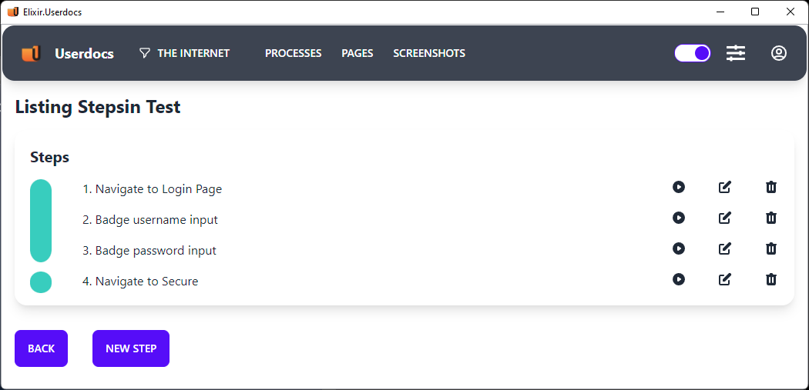

This week we added page tracking to the Process editor in the Beta release of UserDocs.

Based on user feedback, it can be difficult to figure out what page you're on for each step in the process. We added a color bar to the left of each step to indicate clearly when you've navigated to a new page.

