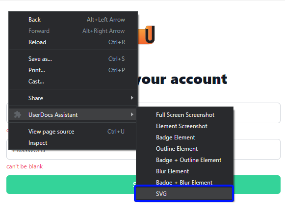
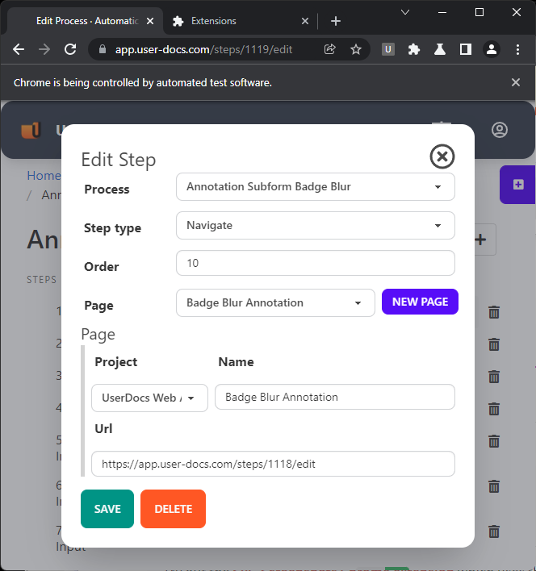

Interested in using vector graphics instead of raster images for screenshots?

I am, and moreso after hearing from blah about their experiences and interest in SVG or Illustrator.

This weekend, I spiked in a feature to the [UserDocs Extension](https://user-docs.com/userdocs-extension/) to create an SVG file representing a web page. 

## In-Browser Approach

I started by adding [dom-to-svg](https://www.npmjs.com/package/dom-to-svg) to the app, and piped through a new menu option that creates an SVG document from the current page.

I tested the feature on a form from my application:

The result was unsatisfactory. I also checked out [dom-to-svg's extension](https://chrome.google.com/webstore/detail/svg-screenshot/nfakpcpmhhilkdpphcjgnokknpbpdllg) to see if I was misusing the library, and got the same result.

## Backend Approach

I'm not easily discouraged, so I decided to try using the devtools protocol to get a PDF, convert it to SVG using [Inkscape](https://inkscape.org/), and optimize it using [SVGO](https://github.com/svg/svgo).

I followed [this guide](https://www.checkbot.io/article/web-page-screenshots-with-svg/) because it boasted some pretty serious size improvements. This approach worked well, with two snags: you can't collect PDF's with a visible copy of Chrome running, and by default, the SVG doesn't have fonts embedded. Inlining all external resources on the page, and sending everything to a background headless Chrome instance would solve both problems. UserDocs could access the background Chrome at any time. Inlining external resources would force them to be embedded in the final SVG. UserDocs doesn't do this, so it will take another round of development to implement SVG collection.

I tested this approach on a few sites, to see how it would affect file sizes. Without doing anything special:

[https://www.checkbot.io/article/web-page-screenshots-with-svg/](https://www.checkbot.io/article/web-page-screenshots-with-svg/)

* PNG: 1233KB
* PDF: 511KB
* SVG: 1257KB
* Minified SVG: 868KB

[https://www.microsoft.com](https://www.microsoft.com)

* PNG: 877KB
* PDF: 314KB
* SVG: 1069KB
* Minified SVG: 1034KB

I didn't see such a consistent decrease in file size. I presume that image and text density can affect how converting a page to SVG might affect file size. I presume that more UI-heavy pages will enjoy a better size reduction. I'll include the sample output from the Microsoft website with this post.