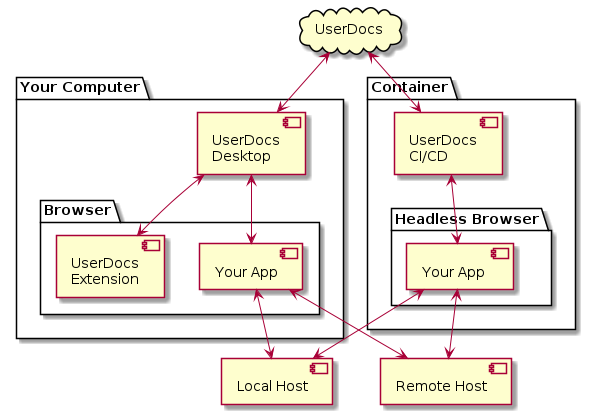

# UserDocs Application Suite

UserDocs is a suite of applications that work together, enabling our customers to automate the process of screenshot collection. We ship:
* A web app that hosts the authoring application
* A desktop application that enables users to execute processes on their local machine
* A CI/CD application that runs jobs headless in a container
* A browser extension that runs inside the automated browser to assist with process authoring

We've tightly integrated our products, and they work together to make the process of screenshot collection as smooth and seamless as possible.
