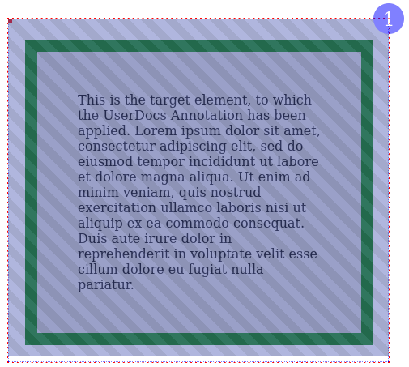

# Annotation Placement

To place annotations without disrupting the flow and spacing of the existing document, UserDocs places multiple elements on the page:
* The locator is a `0px/0px` element that is placed adjacent to the element to annotate
* The mask is an invisible element that is placed over the target element
* The outline is an invisible element (similar to the mask) with a border or outline
* The badge is a visible element that is positioned on the mask

## Locator

To prevent disruption to the document, UserDocs first creates a locator. UserDocs places the locator adjacent to the target element according to the normal flow of the document using `insertAdjacentElement('beforebegin', locatorElement)`. The locator element is `0px/0px` so that it doesn't disrupt the spacing the document. The locator in the figure is a `red 5px/5px` square in top left corner. The locator uses `relative` positioning so that it will move with the document if scrolling occurs.

## Mask

UserDocs places the mask as a child of the locator. UserDocs sets the `top` and `left` properties so that the mask's appropriate corner is on the locator. The mask sits directly over the target element (including the margin). The mask has diagonal purple strips in the figure.  It doesn't cover the target entirely due to the size of the locator in the example.

## Outline

The outline annotation essentially creates a mask with a border or outline, which is configurable using CSS.

## Record Keeping

UserDocs stores all elements added to the document on `window.active_annotations`. A 'clear annotations' step will delete all additive annotations from that object (like badges and outlines). It will not clear annotations that modify the existing element (like blur).

[See this example in a codepen](https://codepen.io/johns10/pen/yLbBPOd)