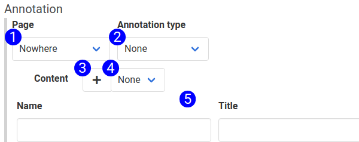

# Annotation Subform Reference

The annotation subform defines the properties of annotations applied to an HTML element. The annotation subform can be seen on the [step form](images/step_form_reference.png)

1. **Page Selector** - Use this input to pick the page to which the annotation belongs.  
2. **Annotation Type Selector** - Use this input to pick the type of annotation this step will apply to the element. Selecting an annotation type will cause the appropriate fields to render dynamically on the form.
3. **Add Content Button** - Clicking this button will add a new content object to the step and clear the fields in the content subform.
4. **Content Selector** - Pick a content object to associate with the annotation. 
5. **Content Subform** - The details of the associated content object.