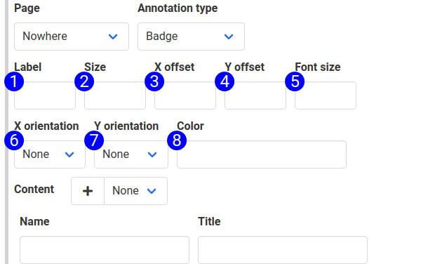

# Badge Annotation Type

The 'badge' annotation type places a circular badge with a single-character label in its center. The badge is an indicator used in conjunction with related text content. See the badge annotations in the following screenshot.

The 'badge' annotation type uses the [annotation mask](annotation_placement.md) to place an invisible mask over the target element. UserDocs places the badge on the mask. The badge can be moved around the mask using CSS or the orientation fields. To create a badge annotation, pick 'Badge' from the annotation type field on the annotation subform.

The default CSS recommended by UserDocs will create a badge that scales with the font size. Examine the default CSS for inspiration.

1. **Label** — This is the label text inside the badge. The badge holds a single character. This character is the innerText of the `userdocs-badge` element.
2. **Size** — The diameter of the badge, in pixels. Set the default width of your annotations using CSS and use this field to override it. This field will set the `width` and `height` properties to `2 * size`.
3. **X Offset** — Specifies a positive, or negative x offset, in pixels. This field is used in conjunction with the x orientation field to calculate a total `left` adjustment in %. This adjustment is `adjustment/parentWidth`.
4. **Y Offset** — Specifies a positive, or negative y offset, in pixels. This field is used in conjunction with the y orientation field to calculate a total `top` adjustment in %. This adjustment is `adjustment/parentHeight`.
5. **Font Size** — Specifies the font size in pixels. The badge will resize according to the font size. 
6. **X Orientation** — Specifies a `left` property of 0% (left), 50% (middle), or 100% (right). Badges will use the CSS-defined `left` value if this field isn't filled. If `left` is absent from CSS, the element will inherit behavior from its parent. In most cases, the badge will render in the top left corner of the target element.
7. **Y Orientation** — Specifies a `top` property of 0% (top), 50% (middle), or 100% (bottom). 
8. **Color** — Sets the background color of the badge. Can use hex or plain English colors. If it works in HTML, it works here.