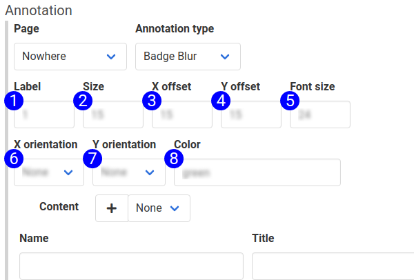

# Badge Blur Annotation Type

The 'badge blur' annotation type combines the [blur](annotation_type_blur.md) and [badge](annotation_type_badge.md) annotations. It obscures the text content in the field or text area, and places a badge to highlight it.

To badge and blur an element on a page, create an 'Apply Annotation' step, and select the 'Badge Blur' annotation type.

The [badge article](annotation_type_badge.md) describes these fields already. They have been annotated with 'badge blur' annotations for illustration.