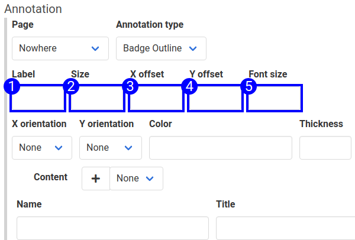

The 'badge outline' annotation type combines the [outline](annotation_type_outline.md) and [badge](annotation_type_badge.md) annotations. It puts an outline around the element, and a badge to help correlate it to text content. 

To badge and outline an element on a page, create an 'Apply Annotation' step, and select the 'Badge Outline' annotation type. 

The [outline](annotation_type_outline.md) and [badge](annotation_type_badge.md) articles describe these fields already. They have been annotated with 'badge outline' annotations for illustration.