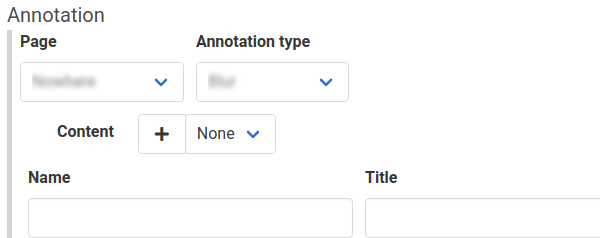

The 'blur' annotation type will anonymize sensitive information on a page, so it will be obscured in the screenshot. The 'blur' annotation type can be used to obscure customer-specific information or prevent users from focusing on unimportant fields.

The 'blur' annotation type modifies the `textShadow` and `color` properties of the target element. `textShadow` is set to `rgba(0, 0, 0, 0.5) 0px 0px 5px`, and `color` is set to `transparent`. 

To blur an element on a page, create an 'Apply Annotation' step, and select the 'Blur' annotation type.

There are no required fields for this annotation type.