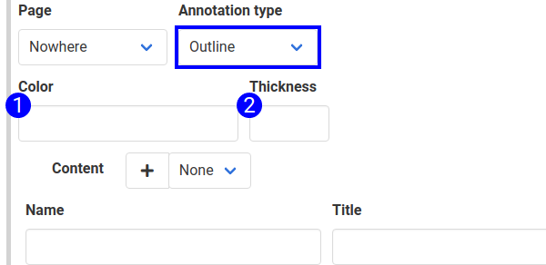

The 'outline' annotation type typically places an outline around the element to annotate. Outlines indicate a single element on the page that needs explanation. Place outlines in conjunction with badges when several items need explanation, but the user should take a single action on the page.

The 'badge' annotation type uses the [locator and the outline element](annotation_placement.md) to place an outline around the target element. See an example of the outline in the following screenshot. 

To add an outline to a page, create an 'Apply Annotation' step, and select the 'Outline' annotation type.

1. **Color** — Sets the color of the outline. Can use hex or plain English colors. If it works in HTML, it works here.
2. **Thickness** — Sets the thickness of the outline in pixels.