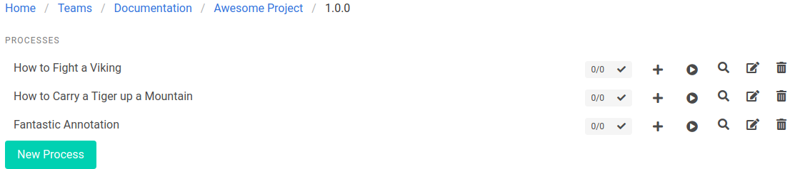

UserDocs is a special purpose automation tool that's used to collect screenshots. There are a number of general-purpose automation features in the tool to help technical writers who don't have access to QA resources. Those tools should not be over-used. Attempt to utilize automation resources, and existing data if it exists. Attempt to do the things that are necessary to collect the screenshot, and nothing else.

If you must create your own data using UserDocs, attempt to prevent your screenshot process from depending on your data creation process. For example, if you must create one or more data objects before you collect a screenshot, make a process to create your data, a process to collect a screenshot, and a process to clean up or delete the data.

## Navigation and Clicks

When authoring processes, always navigate explicitly. Using click steps to drive navigation will add complexity to your processes. You may need to add waits to get your process working. Click-based navigation can also make processes flaky.

Here's an example from the UserDocs product: the Processes Index page.
* It's a standard index page with a list of items and a 'New' button.
* The index page and the form have different routes (`/processes` and `/processes/new`).

To document the Processes Index page, you should:
* Navigate to `/processes`
* Make any necessary annotations
* Take a screenshot

To document the Processes Form, you should:
* Navigate to `/processes/new`
* Make any necessary annotations
* Click on any necessary elements
* Take a screenshot of the form element

You should not:
* Navigate to `/processes`
* Click on 'New Process'
* Annotate the form
* Take a screenshot

In some scenarios, there may not be a route for your form. It may be a JavaScript only popup or submenu. In these cases, use a click to open the form.

## Asynchronous Elements

Modern JavaScript applications often have asynchronous elements that improve user experiences, but can be very difficult to automate. That's because that they expect a specific set of interactions that a human will naturally perform. These interactions may not be intuitive to implement in an automated process.

Asynchronous elements may have unpredictable timing because they will make server calls based on user input, and render elements based on the response. You and the UserDocs application may not have control or visibility to that request-response cycle. UserDocs has built-in waits for actions that interact with specific elements. However, you may need to implement waits to ensure the entire request-response cycle has completed before taking the next steps in your process.

For example the [swiftype autocomplete component](https://swiftype.com/documentation/site-search/autocomplete) that's used on many documentation will expect you to click in the search box before sending keys to it. This is not obvious when designing automation, and if you just start sending it keys, some of your input may be dropped unexpectedly.

