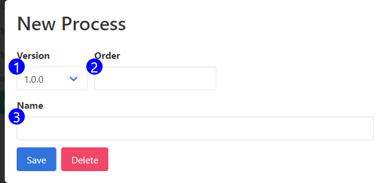

The process form is used to interact with existing processes, and create new ones. 

1. **Version** - Use this input to move a process to a different version. Changing the version and saving this form will change the version of the process. Note that it may disappear from this menu if the process doesn't belong to the version you're displaying/have selected with the version picker.
2. **Order** - This field is not used at this time.
3. **Name** - This is a friendly name, which will be used to display the element, and as a component when generating automatic names for images.