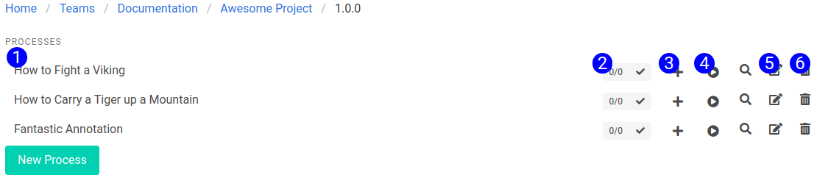

# Processes Page

The Processes page displays all the processes for the selected team, project and version.  The current selections are displayed in the breadcrumb.

## Processes

The processes are listed here. Interact with them by clicking the referenced element.

1. **Process Title** - Click this item to open the steps for this process. Clicking this link will take you to the steps page for this process.
2. **Process Status Indicator** - This status indicator represents the current status of the process. It will show the number of completed processes out of the last 5 process instances in an x/5 format. If the last process instance failed, it will turn red and show an x. If any of the last 5 process instances failed, it will show a yellow warning. Clicking the status indicator will open a modal showing the last 5 process instances, and the error messages and stack traces associated with them.
3. **Add to Job** - The plus symbol will add the process as the last element of the current job. 
4. **Run Process** - The play symbol will run the current process. It will create a process instance, associated with the process, and one step instance associated with each step. As each step finishes, it will report back with it's status. If the process fails, it will set the status of the failed step, and leave the remaining step instances in a `not_started` state.
5. **Edit Process** - The edit button will open the process menu, so that you can modify that process.
6. **Delete Process** - Deletes the process.