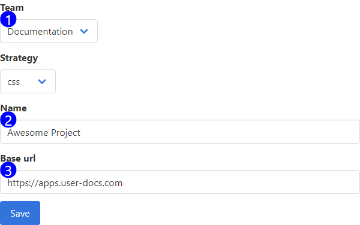

Use this form to interact with existing, and create new projects in your teams workspace.

1. **Team Selector** - Use this input to update the team that this project belongs to. If you change the team for the project, it will dissappear from your UI. To access the project, you must switch over to the team you moved the project to. 
2. **Name** - The name of the project. Used for display purposes.
3. **Base URL** - The base URL for your project. This isn't used in the application right now. In the future, UserDocs will dynamically generate page URL's based on this value.
4. **Default Version** - The default version for this project. UserDocs will use this value to display data in the application before a user selects their team, project, and version.

## Accessible at

`/projects/:project_id/edit`
`/projects/new`
