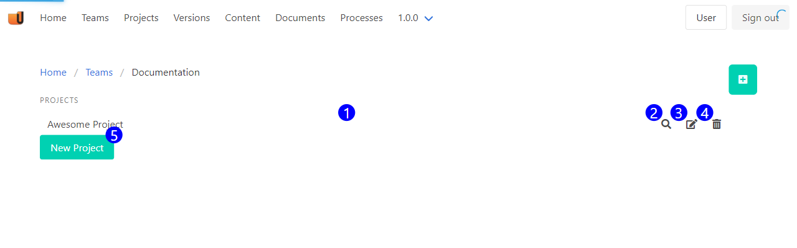

Use the Project Menu to administer a teams projects. Use this menu to list the projects your team owns, interact with existing projects, and create new ones.

1. **Existing Project** - Click the existing project to open the [versions menu](version_menu_reference.md) for this project. This link will ignore your current project selection, and show the versions for the project you clicked. Use this to administer projects that you don't have selected.
2. **Show Project** - Shows this project. The show menu displays the default version for this project, and the projects versions.
3. **Edit Project** - Opens the [project form](project_form_reference.md) for this project.
4. **Delete Project** - Opens a confirmation dialogue, and then deletes the project.
5. **New Project** - Create a new project.

## Accessible at

`/teams/:team_id/projects`

Displays the projects for a specific team. Used to drill down to a process when you've selected a different version in the picker.

`/projects`

Displays the processes for the selected team.