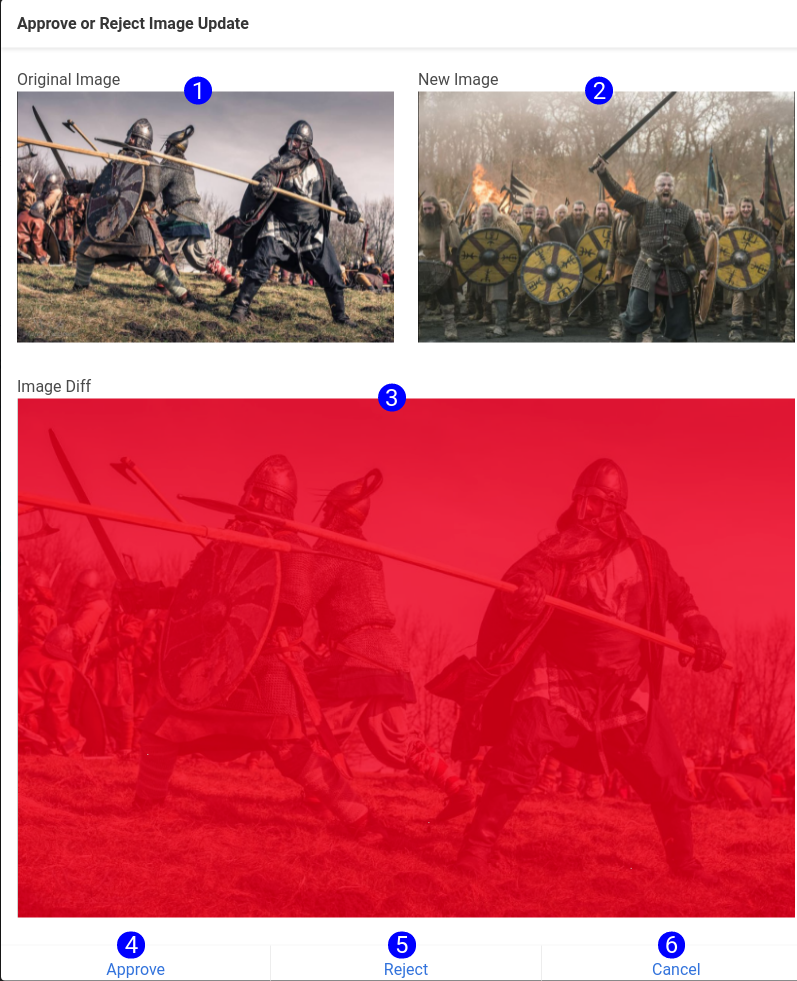

## Screenshot Approval

Whenever processes run, UserDocs will compare the collected images to the current images. Userdocs uses ```magick compare -metric PSNR``` to diff the images in the background. UserDocs will not diff images that don't have the same height and weight. The approval workflow will be displayed without the diff.

No comparisons or guarding will occur on your local machine. The local file will be overwritten immediately when the step executes. UserDocs expects that your local copies are vestigial, and that changes will be managed when they are pushed to your repo. 

The Screenshot Approval menu is displayed when you click 'Review Changes' on a screenshot preview. This menu is used to approve or reject changes to screenshots that occured during job/process/step runs.



1. **Original Image** - Displays the original image held on AWS. This image will be named `screenshot_name`.png.
2. **New Image** - The new image on AWS. This image will be named `screenshot_name`-provisional.png.
3. **Image Diff** - A diff of the two images. Any differences between the two images will be highlighted in red.
4. **Approve** - Approving the change will overwrite the original image with the provisional. The production image will change to the new one.
5. **Reject** - The original, provisional, and diff images stay the same. The screenshot warning will no longer render in the process or step menus.
5. **Cancel** - Nothing happens. The files stay the same, and the warning continues to render.
