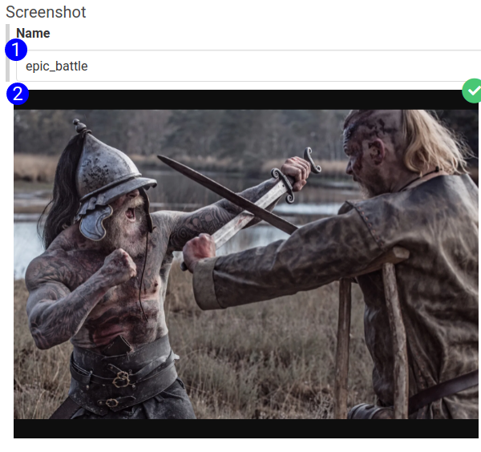
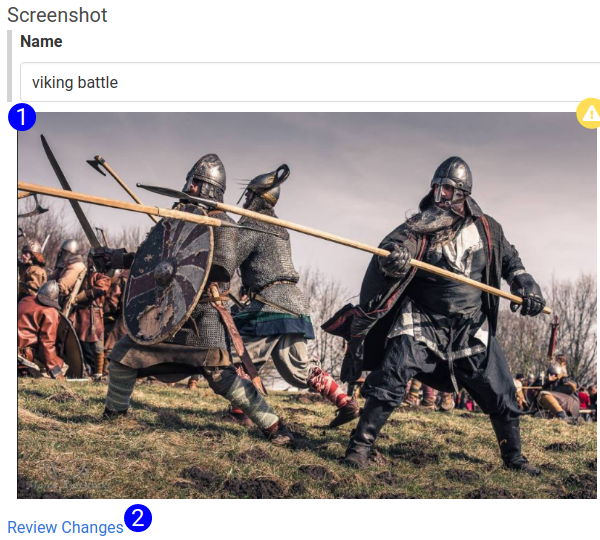

## Screenshot Subform

The Screenshot subform is displayed on the step form for any step type that references screenshots ([Element Screenshot](step_form_element_screenshot.md) and [Full Screen Screenshot](step_form_full_screen_screenshot.png)).

1. **Name** - The filename that the screenshot will save this screenshot as. If a name is given, the screenshot will be saved with the name. If a name is not given, the screenshot will initially be created with a temporary filename until the database record is saved, then it will be renamed. If no name is given, an automatically generated name will be applied to the screenshot.
2. **Ok Preview** - A preview of the file. If this screenshot has been created normally, it will show a green checkbox in the upper right hand corner.

1. **Warn Preview** - If the screenshot has changed since the last time the step ran, it will be indicated with a yellow warning.
2. **Review Changes** - Any screenshots that have change must be reviewed and approved before the new screenshot will be pushed to the AWS bucket. Click this link to open the ([Screenshot Approval Menu](screenshot_approval_menu.md)