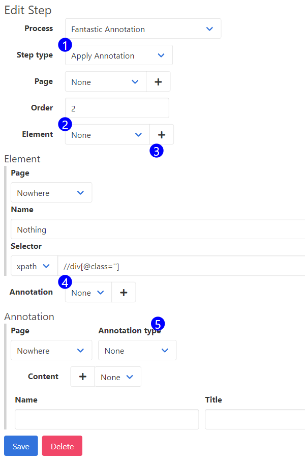

# Apply Annotation Step Form

The 'Apply Annotation' step type adds or modifies HTML elements on a web page. Those elements can highlight, annotate, or obscure existing content. Use annotations to apply graphics before taking the screenshot, so you don't have to apply them manually with another tool. These elements will be applied in the CI/CD and desktop applications.

UserDocs changes HTML content to create annotations. In most cases, UserDocs attempts to make all annotations without modifying the existing document structure or styles. Some cases preclude UserDocs from making these modifications without changing the style or structure of the underlying document (like blurring text).  

UserDocs assigns each annotation a default CSS class. It is considered best practice to style annotations in your applications CSS. 

UserDocs will inject a user-defined style tag into every page loaded in the automated browser. The contents of that style tag is defined on the CSS field on your team. That default style tag will include styles for the default classes (`userdocs-badge` etc).

If you can't get CSS added to your application, style the annotations using the CSS field on the team. 

Filling in the actual fields on these forms should be used as a last resort when you can't get the styling to work with CSS, or the annotation you are working with is unique. The fields on the forms are typically modifying CSS styles.

Each Annotation type interacts with the DOM differently, and each is covered separately. To create an 'Apply Annotation' step, go to an existing or new step, and select the 'Apply Annotation' step type.

1. **Step Type Selector** - Use this input to pick the step type. Fields in the form will be exposed or hidden based on the selected step type. To set up an 'Apply Annotation' step, select it here.
2. **Element Selector** - Use this input to select which element to apply the annotation. The element may be modified, an element may be placed adjacent to it on the DOM, or an element may be placed as a child of this element.
3. **Element Subform** - The details about the element. Update this form and hit save to update the element. For more information on the Element Subform, see [this related article](element_subform.md)
4. **Annotation Selector** - Use this input to pick an existing annotation, if you'd like to reuse one (we don't recommend it).
5. **Annotation Subform** - The details about the annotation. Update this form and hit save to update the annotation. For more information on the Annotation Subform, see *this related article*.