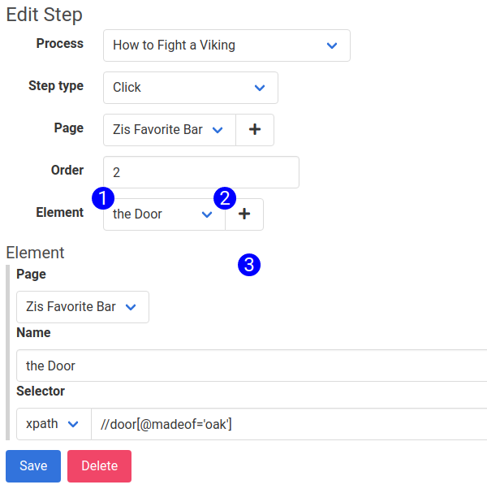

## Click Step Form

Selecting Click from the Step Type select input will cause the Click form to render, displaying these fields:

1. **Element Selector** - Picks the element to associated with the step. UserDocs will locate the element with the strategy and selector specified on the object, and simulate a click on the object.
2. **Create Element** - Creates an empty element object, clearing the fields in the Element subform.

For more information on the Element Subform, see [this related article](element_subform.md)

> The Transfer Selector and Test Selector features are currently offline, and will be re-enabled in the near future.

## Accessible at
`/steps/:id/edit`