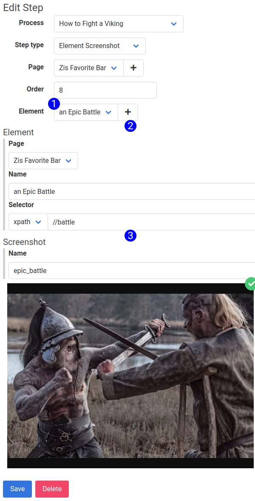

The Element Screenshot will take a screenshot of the indicated element, and save it to your AWS bucket, and local machine. Selecting Element Screenshot from the Step Type select input will cause the Element Screenshot form to render, displaying these fields:

1. **Element Selector** -- Use this input to select which element to take a screenshot.
2. **Element Subform** -- The details about the element to be captured. Update this form and hit save to update the element. For more information on the Element Sub-form, see [this related article](element_subform.md)
3. **Screenshot Sub-form** -- The screenshot sub-form. For more information on the Screenshot Sub-form, see [this related article](screenshot_subform_reference.md)

## Accessible at
`/steps/:id/edit`