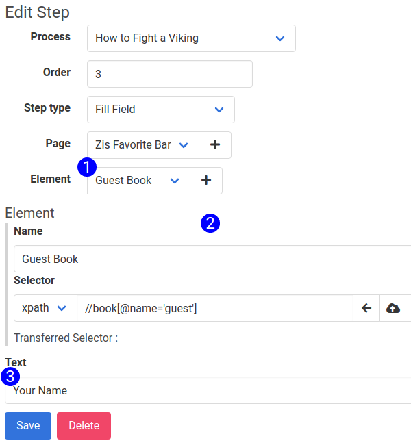

# Fill Field Step Form

The Fill Field Step Type will simulate user input to a field. It will enter the specified string of characters into the selected element. Selecting Fill Field from the Step Type select input will cause the Fill Field form to render, displaying these fields:

1. **Text** - The string of characters to be entered in to the field.
2. **Element Selector** - Picks the element to associated with the step, or create a new one.
3. **Element Subform** - For more information on the Element Subform, see [this related article](element_subform.md)

## Accessible at
`/steps/:id/edit`