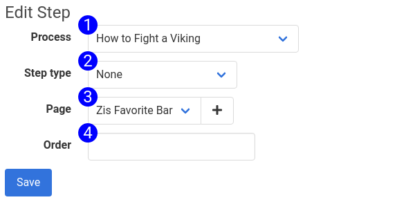

# New Step Form

When creating a step for the first time, most options will not be available. Select your step type to expose other options.

1. **Process Selector** - Use this input to move a step to a different process. Changing the process and saving this form will change which process the step belongs to. It will disappear from the menu after you save it.
2. **Order** - This is the order that the step will be executed in. This field is important, and must be entered. UserDocs recommends ordering your steps in 10's, so that you have room to insert new steps. This field will be deprecated when we implement drag-and-drop ordering.
3. **Step Type** - This field is used to pick the Step Type. When editing the form, additional fields will appear depending on the step type you select.

## Accessible at
`/steps/new`