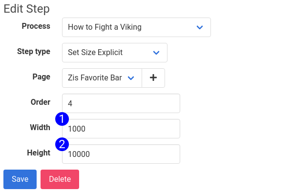

# Set Size Explicit Step Form

The Set Size Explicit Step Type may set the size of the viewport, or the window in the browser depending on the automation framework in use. Selecting Set Size Explicit from the Step Type select input will cause the Set Size Explicit form to render, displaying these fields:

1. **Width** - The width (in pixels) to set the viewport
2. **Height** - The height (in pixels) to set the viewport

## Accessible at
`/steps/:id/edit`