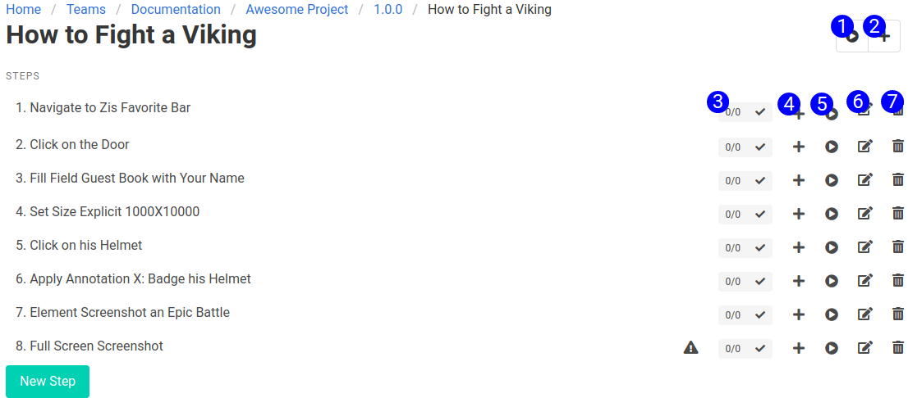

The steps menu shows all the steps in a process. It is always filtered by the process id in the URL. It's typically accessed in the context of the selected version. The breadcrumb to the record is displayed at the top of the page.

1. **Execute Process** - Runs the current process. It will create a process instance, associated with the process, and one step instance associated with each step. As each step finishes, it will report back with it's status. If the process fails, it will set the status of the failed step, and leave the remaining step instances in a `not_started` state. You'll notice the status indicators for each individual step change when you click the play button.
2. **Add Process to Job** - The plus symbol will add the process as the last element of the current job.
3. **Step Status Indicator** - This status indicator represents the status of the step. It will show the number of completed steps out of the last 5 step instances in an x/5 format. If the last process instance failed, it will turn red and show an x. If any of the last 5 step instances failed, it will show a yellow warning. Clicking the status indicator will open a modal showing the last 5 step instances, and the error messages and stack traces associated with them.
4. **Add Step to Job** - Adds the step as the last element of the current job.
5. **Run Step** - Runs the current step. It will create a step instance, associated with the step. As each step finishes, it will report back with its status. If the step fails, it will set the status of the step instance to failed.
6. **Edit Step** - Opens the step form to edit this step.
7. **Delete Step** - Deletes this step.

## Accessible at

`/processes/:process_id/steps`