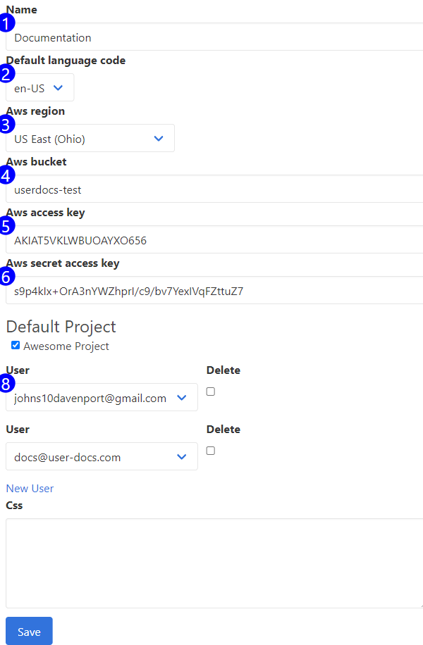

Change your teams' settings on the team form, and administer what users have access to your team's content.

UserDocs uses your AWS bucket to store images for the application. You must enter credentials here for the image backend to work. UserDocs will create presigned URL's for the application, so no special security settings are necessary for the application to work.

1. **Name** - The name of your team.
2. **Default Language Code** - The default language your team speaks and writes. The default languaged used by UserDocs when presenting documentation.
3. **AWS Region** - The region of your AWS bucket.
4. **AWS Bucket** - The name of your bucket.
5. **AWS Access Key** - Access key for the AWS account you've provisioned for this integration.
6. **AWS Secret Access Key** - The secret for the AWS account you've provisioned for this integration.
7. **Default Project** - The default project for the team. UserDocs will display data from this project to users who haven't yet selected their current project.
8. **Team Users** - Use this subform to provision users to work on this team with you. You can remove, update, and add new users with this subform.
9. **CSS** - UserDocs will inject this CSS code into the automated browser every time it starts up. Use it to style your annotations, minimizing the data entry required to apply annotations to your page.

## Accessible at
`/teams/:id`