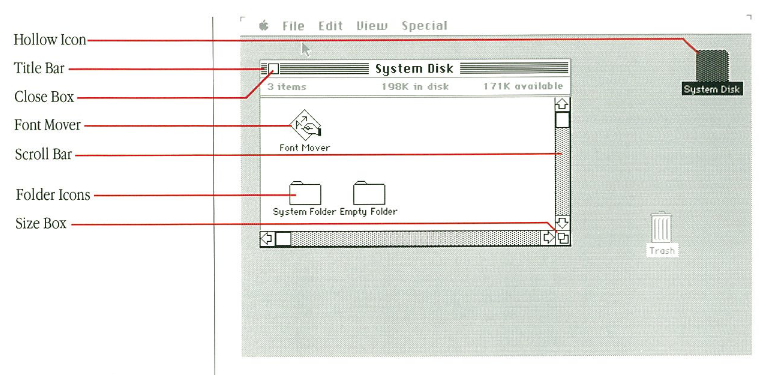
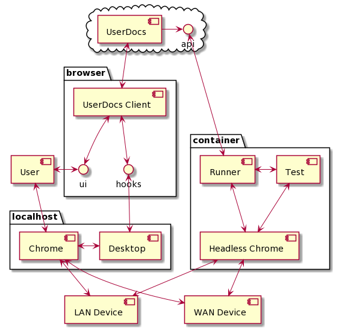
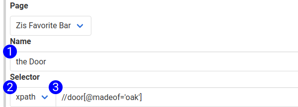

# UserDocs
## Automated Screenshot Collection for Web-Based Software

In 1983, Apple revolutionized the computing industry with the release of the Macintosh. With it, they released the first user manual we could find that included screenshots of their GUI. This manual included gems such as:

This was the first time most people would see an annotated screenshot of a computer application. If you thumb through [the manual](http://www.maccaps.com/MacCaps/DIY_Information_files/Macintosh_Manual_1984.pdf) you'll find hundreds of screenshots that someone manually collected, annotated, and included in the manual. 

Almost 40 years later, many technical writing teams have adopted the Docs as Code philosophy. We are tightly integrated with development teams. We ship docs to source control repos, and have comparably complex, flexible and automated deployment pipelines. Yet, most technical writers are still manually collecting and annotating screenshots.

The process of manual screenshot collection and annotation is incredibly monotonous and time-consuming. Every time the software changes, the screenshots are out of date, and must be updated. For companies that ship code rapidly, technical writers can feel like they are always behind as they update the documentation.

## Automate with UserDocs

UserDocs can fully automate the screenshot collection, and annotation process. It provides a way to interacitvely author automated processes, and run them 

UserDocs ships:
* A server, which is used to author automated screenshot collection processes
* A desktop cient, which runs a local Chrome instance on the users machine, and executes automated processes interactively
* A CICD client, which runs independently, queries the server, and executes automated processes on a headless browser
* The CICD client can also interact with an existing QA pipeline. Include the runner in your QA script, pass it a browser instance, and tell it to execute a job, and it will do so in the context of your existing pipeline. We are very early stage, and only support javascript + puppeteer, but if you are interested in using the product, open an issue with your requirements and we'll be in touch.

## Results

By using UserDocs, you can automatically generate screenshots like this, and insert them into your CICD pipeline. As screenshots are collected, UserDocs will diff them against the existing version, and give you an opportunity to review and approve all changes before they are released to your storage bucket. 

All the screenshots in our documentation are generated using the UserDocs applications.  